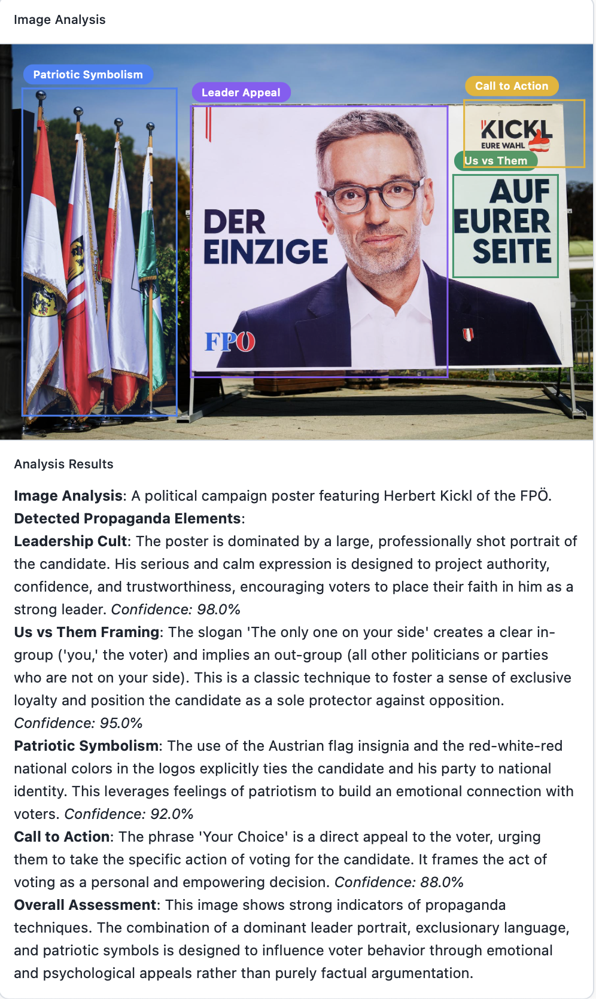

# Propaganda Spotter AI

Propaganda Spotter is a powerful web application that uses a multi-modal AI model to detect, analyze, and highlight propaganda techniques in images. Upload an image, and the tool will identify elements related to techniques like Leader Appeal, Patriotic Symbolism, and Us vs. Them framing, providing a detailed analysis of how the imagery is designed to influence viewers.



## Features

- **AI-Powered Analysis:** Leverages a CLIP-based model to analyze images for a dozen pre-defined propaganda concepts.
- **Explainable AI (XAI):** Uses Grad-CAM to generate attention maps, showing *which* parts of the image the model focused on for its analysis.
- **Interactive Bounding Boxes:** The detected propaganda elements are highlighted with bounding boxes directly on the image.
- **Resizable and Editable Boxes:** Users can resize, move, and edit the labels of the bounding boxes to refine the analysis.
- **Detailed Textual Analysis:** Provides a comprehensive summary of the detected techniques, explaining their purpose and psychological impact.
- **Modern Frontend:** A clean and responsive user interface built with React, TypeScript, and Shadcn UI.
- **FastAPI Backend:** A robust and fast Python backend serving the AI model.

## Tech Stack

- **Frontend:**
  - React & TypeScript
  - Vite
  - Tailwind CSS
  - Shadcn UI
  - `react-rnd` for interactive boxes
  - `react-markdown` for text rendering
- **Backend:**
  - Python & FastAPI
  - PyTorch
  - Hugging Face Transformers (CLIP, BLIP)
  - `torch-cam` for Grad-CAM implementation
  - Uvicorn

## How It Works

1.  **Image Upload:** The user uploads an image to the React frontend.
2.  **API Request:** The frontend sends the image to the FastAPI backend.
3.  **Image Captioning:** A BLIP model generates a general, descriptive caption of the image for context.
4.  **Propaganda Detection:** A CLIP model calculates the similarity between the image and a list of defined propaganda concepts (e.g., "leader worship imagery", "patriotic symbols").
5.  **Attention Map Generation (Grad-CAM):** For the highest-scoring concepts, `torch-cam` is used to generate Grad-CAM heatmaps. These maps visualize the specific regions of the image that activated the model for that concept.
6.  **Bounding Box Creation:** The application finds contours in the high-attention areas of the heatmaps to create bounding boxes.
7.  **Analysis Generation:** A detailed textual summary is constructed based on the detected concepts and their descriptions.
8.  **Response to Frontend:** The backend sends the caption, bounding boxes, and analysis text back to the frontend to be displayed to the user.

## Getting Started

### Prerequisites

- Python 3.8+
- Node.js 16+
- `npm`

### 1. Clone the Repository

```bash
git clone https://github.com/your-username/propaganda-spotter-web.git
cd propaganda-spotter-web
```

### 2. Run the Setup Script

This script will install all the necessary frontend and backend dependencies. It only needs to be run once.

```bash
./setup.sh
```

### 3. Start the Application

This will start both the backend and frontend development servers.

```bash
./run.sh
```

- The frontend will be available at `http://localhost:5173` (or another port if 5173 is busy).
- The backend API will be running at `http://localhost:8000`.